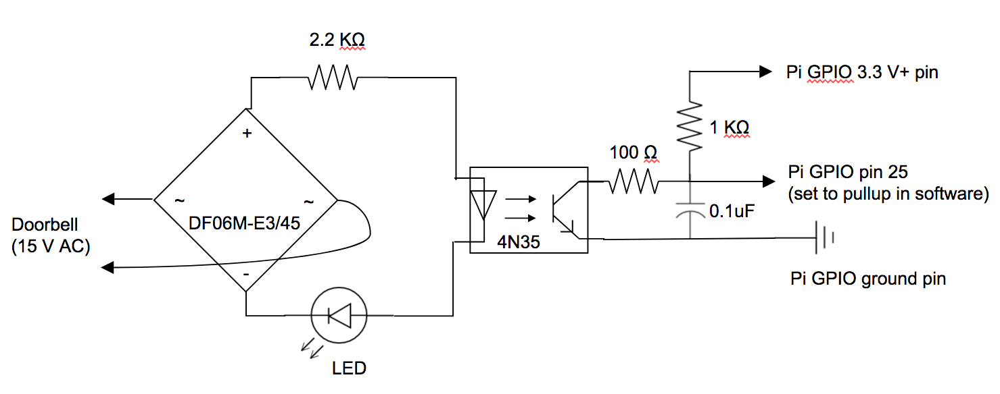
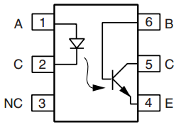

# pibell - A Raspberry Pi Powered Doorbell

An existing wired doorbell rings a buzzer, but this cannot be heard in all parts of the house. The existing doorbell cannot be replaced.

The solution described here uses a Raspberry Pi Zero W to detect a doorbell press and send a notification with [Pushover](https://pushover.net/).

## Part 1 - Circuit

The doorbell system runs at 15 V AC. A bridge rectifier (DF06M-E3/45) is used to convert this to DC, and a 2.2 KΩ current limiting resistor limits the current reaching the optocoupler (4N35). An LED provides visual confirmation that the doorbell is being rung (for testing).

The optocoupler is connected directly to the Raspberry Pi's GPIO header via a low pass filter. Without this filter (the two resistors and the capacitor) there were false positives due to RF interference.

**Circuit Diagram**



**4N35 Optocoupler**

The optocoupler used here actually has 6 pins. Pins 1 and 2 in the image below are connected to the bridge rectifier; pins 5 and 4 are connected to the GPIO header.



**Pin layout of Raspberry Pi Zero W**


## Part 2 - Installation

The chosen location must have:
- Access to the doorbell wiring being monitored
- A power point to power the Pi
- WiFi so the Pi can send notifications
- Protection from damp and extremes of temperature

In my case I mounted the Pi and breadboard inside a small food container screwed to the wall under the stairs. Rather than use a transformer to power the Pi I replaced an existing electrical socket nearby with one that had two built-in USB outlets.

## Part 3 - Python Script

The script waits for a drop (a "falling edge") in the voltage across the GPIO pins to be detected. This happens when the doorbell is pressed, and triggers a notification. It then ignores input for 10 seconds before going back to waiting, to avoid multiple notifications due to someone pressing the bell repeatedly.

```python
#!/usr/bin/python

import RPi.GPIO as GPIO
import httplib
import urllib
from time import sleep

# Set GPIO pin numbering scheme to BCM
GPIO.setmode(GPIO.BCM)

# Set GPIO pin to input, set it to pull up (as we are monitoring difference to ground)
GPIO.setup(25, GPIO.IN, pull_up_down=GPIO.PUD_UP)

# Endless loop
while True:

    # Wait for interrupt
    print 'Waiting for doorbell...'
    GPIO.wait_for_edge(25, GPIO.FALLING)

    # Notify using Pushover
    print 'Sending notification'
    conn = httplib.HTTPSConnection("api.pushover.net:443")
    conn.request("POST",
                 "/1/messages.json",
                 urllib.urlencode({
                                  "token": "YOUR_APP_TOKEN_HERE",
                                  "user": "YOUR_USER_KEY_HERE",
                                  "title": "Doorbell!",
                                  "message": "Somebody just rang the doorbell",
                                  }),
                 {"Content-type": "application/x-www-form-urlencoded"})
    response = conn.getresponse()
    print 'Status ' + response.status + ': ' + response.reason

    # Wait 10 seconds so doorbell press(es) end
    sleep(10)

# Clean up GPIO on exit
GPIO.cleanup()
```
## Part 4 - Supervisor

After testing the script we need a way to run it as a process (daemonize it) and make sure it runs at startup. One way to do this is to use [supervisor](http://supervisord.org/index.html).

Install supervisor with sudo:

`sudo pip install supervisor`

Create a sample config file:

`sudo echo_supervisord_conf > /etc/supervisord.conf`

Edit the new config file:

`sudo nano /etc/supervisord.conf`

Add a new program called "pibell", specifying the path to the Python script above.

```ini
[program:pibell]
command=/home/pi/pibell.py
user=pi
```
When supervisor runs it will now run the script. There are many other options available in the config file, such as restarting the script automatically if it crashes.

We now need to configure supervisor itself to run at system startup. To do this we will use systemd. First create a new service file:

`sudo nano /etc/systemd/system/supervisor.service`

Paste in the following:

```ini
[Unit]
Description=supervisord - Supervisor process control system for UNIX
Documentation=http://supervisord.org
After=network.target

[Service]
Type=forking
ExecStart=/usr/local/bin/supervisord -c /etc/supervisord.conf
ExecReload=/usr/local/bin/supervisorctl reload
ExecStop=/usr/local/bin/supervisorctl shutdown
StandardOutput=syslog
StandardError=syslog
SyslogIdentifier=supervisor
User=root

[Install]
WantedBy=multi-user.target
```
_Note that the `/usr/local/bin/` part of the paths may be different in your environment._

Set file permissions:

`sudo chmod u+rwx /etc/systemd/system/supervisor.service`

Configure the new service to run at boot:

`sudo systemctl enable supervisor`

Start the service now (no need to reboot):

`sudo systemctl start supervisor`

The  script can now be monitored and started/stopped using **supervisorctl**.

`sudo supervisorctl` opens a command console with all options (and help).

`sudo supervisorctl restart pibell` will restart the  script.


